# IEEE-CIS Fraud Detection

## Project Overview
This dataset come from one of the kaggle competition which is [IEEE-CIS Fraud Detection](https://www.kaggle.com/c/ieee-fraud-detection)

The data comes from Vesta's real-world e-commerce transactions and contains a wide range of features from device type to product features. You also have the opportunity to create new features to improve your results.

The goal is to create & deploy machine learning pipeline to classify which transaction is fraudulent.

The overall architecture diagram are as below.
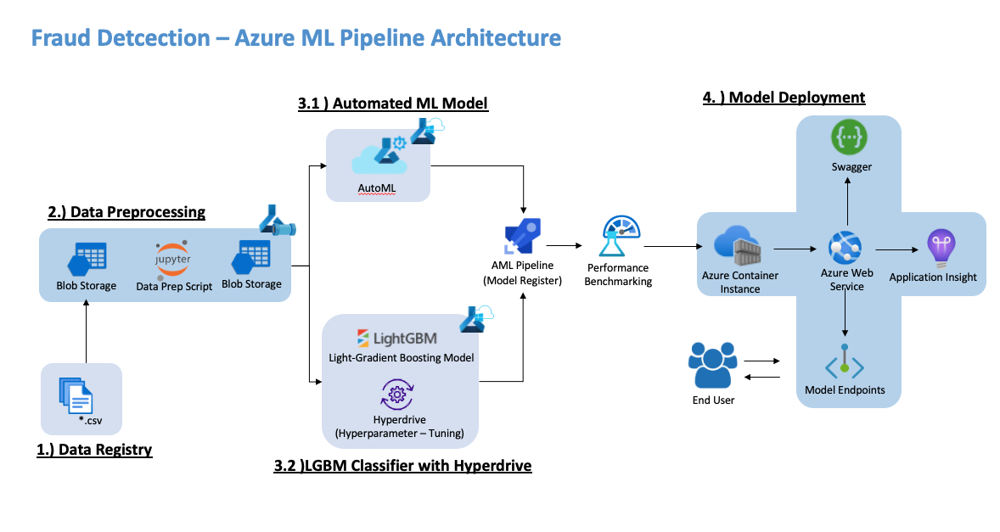


## **Dataset** 


From this dataset we will predict the binary value (1, 0) that which online transaction is fraudulent, as denoted by the binary target `isFraud`. All of the data have been provided by Vesta Corporation by following [Link](https://www.kaggle.com/c/ieee-fraud-detection/data)

The data is broken into two files `identity` and `transaction`, which are joined by `TransactionID`. Not all transactions have corresponding identity information.

### Categorical Features - Transaction
- ProductCD
- card1 - card6
- addr1, addr2
- P_emaildomain
- R_emaildomain
- M1 - M9

### Categorical Features - Identity
- DeviceType
- DeviceInfo
- id_12 - id_38

The `TransactionDT` feature is a timedelta from a given reference datetime (not an actual timestamp).

### **Task**
Binary Classification.

### ** Project Setup
To follow along with this project document, all you need before start is below step.
> 1. Azure Machine Learning Workspace (Create within resource group of Azure Scription)
> 2. Jupyter notebook 2 main file are `automl.ipynb` and `hyperparameter_tuning.ipynb`
> 3. All python script in folder `data_prep` and `train_model` is customer script that will be use as a part of pipeline.
> 4. Environment file `hyperdrive_env.yml` for customer training script with hyperdrive

Then upload all of these file into your notebook working space in Azure Machine Learning Studio.


## Steps of Work
1. Setup Azure ML workspace (Data Registry, Compute Instance, Compute Cluster)
2. Create data pipeline for data preprocessing.
3. Create **AutoML** Experiment, Submit, Register Model.
4. Create **Customer Script** Experiment, Submit, Register Model.
5. Model Performance Benchmarking and Deployment.
6. Endpoints request testing.

## 1.) Azure Machine Learning Workspace
When you are working with Azure ML, first thing to do is indicate the workspace.

If you are working on Azure ML notebook workspace. All you have to do this execute below script.

```python
# Initiate default workspace
ws = Workspace.from_config()
``` 
But if you want to work with your local computer. You can dowload `config.json` and place within the same folder you are working.
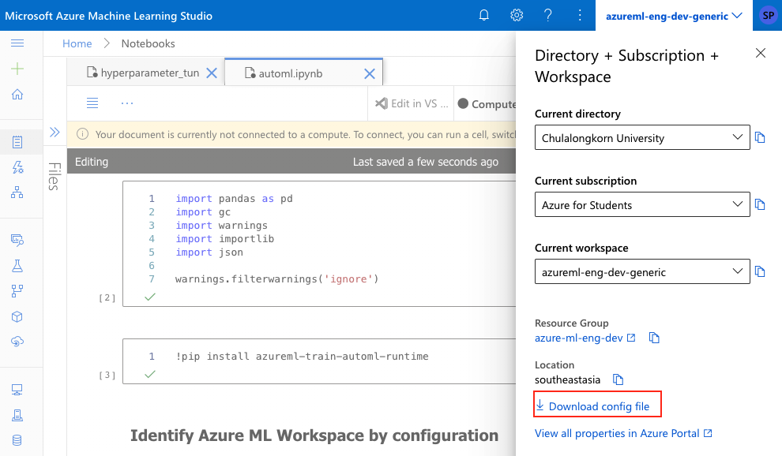

Then next step is register and locate the dataset.
To register data, their are many method to do

I give you one simplest method by using Azure ML UI to upload it. Start by click on `Create dataset`
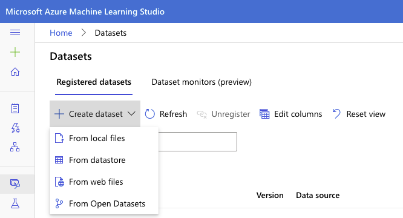

Then follow along the step of work in UI. The option to upload from file will be available.


After complete all the require step. we can go back to check the avaialble registered data. <br>
Here we will use `CIS Fraud Detection_train_identity` and `CIS Fraud Detection_train_transaction` as a data source for this project.
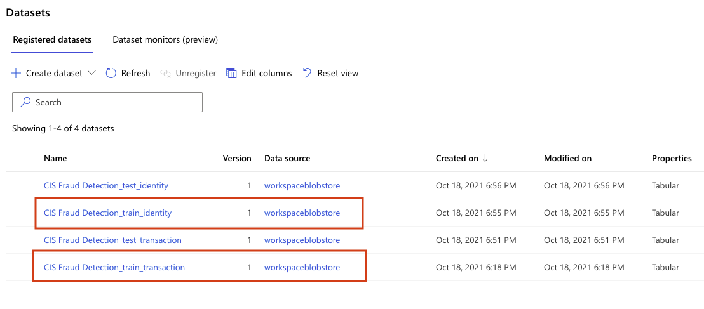

Then we can indicate to location of data by using below scripts. `.get_by_name()` recieve 2 attributes workspace object and name of dataset you registered.
```python
train_transaction = Dataset.get_by_name(ws, name='CIS Fraud Detection_train_transaction')
train_identity = Dataset.get_by_name(ws, name = 'CIS Fraud Detection_train_identity')
``` 
Then before we go to submit any run from the notebook. compute instance need to be created by using below script.
```python
from azureml.core.compute import ComputeTarget, AmlCompute
from azureml.core.compute_target import ComputeTargetException

cpu_cluster_name = "ml-dev-clus"
# Verify that cluster does not exist already
try:
    cpu_cluster = ComputeTarget(workspace=ws, name=cpu_cluster_name)
    print('Found an existing cluster, using it instead.')
except ComputeTargetException:
    compute_config = AmlCompute.provisioning_configuration(vm_size='STANDARD_D12_V2',
                                                           min_nodes=0,
                                                           max_nodes=6)
    cpu_cluster = ComputeTarget.create(ws, cpu_cluster_name, compute_config)
    cpu_cluster.wait_for_completion(show_output=True)
```
You can specify the `vm_size` base on your quota and usage limitation also `max_nodes` of virtual machine when it need to scale out or parallel run.

And environment for submit any experiment need to be created by using below script.
```python
from azureml.core.runconfig import RunConfiguration
from azureml.core.conda_dependencies import CondaDependencies
from azureml.core.runconfig import DEFAULT_CPU_IMAGE, DockerConfiguration

# create a new runconfig object
run_config = RunConfiguration()

# enable Docker 
docker_config = DockerConfiguration(use_docker=True)
run_config.docker = docker_config

# set Docker base image to the default CPU-based image
run_config.environment.docker.base_image = DEFAULT_CPU_IMAGE

# use conda_dependencies.yml to create a conda environment in the Docker image for execution
run_config.environment.python.user_managed_dependencies = False

# specify CondaDependencies obj
run_config.environment.python.conda_dependencies = CondaDependencies.create(conda_packages=['pandas','scikit-learn','numpy'],
                                                                            pip_packages=['azureml-sdk[automl]'])
```
Object `run_config` will be used for on every data preprocessing pipeline step in this project.

## 2.) Data Preprocessing as a pipeline
In this project, 3 data preprocess custom steps need to done before feed data into machine learning model.<br>
Starting from `clean_data.py` then `select_col.py` and `feature_engineering.py` each step will create data output from one to another. (All of customer script for data preprocessing stored in `data_prep` folder)

To establish data pipeline object, there are 3 important things to create.
Input, Script Source and Output. Below how to create Pipeline step-1

```python
## Script Source
source_directory="./data_prep"

## Output specification
cleaned_data = PipelineData("cleaned_data", datastore=def_blob_store).as_dataset()

CleanStep = PythonScriptStep(
    script_name="clean_data.py", 
    arguments=["--output_combine", cleaned_data],
    inputs=[train_transaction.as_named_input('input_transaction'), train_identity.as_named_input('input_identity')], ## Input data 2 source
    outputs= [cleaned_data], ## Output data 1 source
    compute_target=cpu_cluster, 
    source_directory=source_directory,
    runconfig=run_config,
    allow_reuse = True
)
```
Step 2 for `select_col.py`
```python
source_directory="./data_prep"

selected_data = PipelineData("selected_data", datastore=def_blob_store).as_dataset()
SelectedStep = PythonScriptStep(
    script_name="select_col.py", 
    arguments=["--output_selected", selected_data], 
    inputs=[cleaned_data.parse_parquet_files()], # Input data from previous pipeline
    outputs= [selected_data], # Output data for next pipeline
    compute_target=cpu_cluster, 
    source_directory=source_directory,
    runconfig=run_config,
    allow_reuse = True
)
```
and Step 3 for `feature_engineering.py`
```python
source_directory="./data_prep"

train_data = PipelineData("train_data", datastore=def_blob_store).as_dataset() ## Last input for machine learning model

FeatureEngineeringStep = PythonScriptStep(
    script_name="feature_engineering.py", 
    arguments=["--output_train_data", train_data],  
    inputs=[selected_data.parse_parquet_files()], # Input data from previous step
    outputs= [train_data], # Output data for training model step
    compute_target=cpu_cluster, 
    source_directory=source_directory,
    runconfig=run_config,
    allow_reuse = True
)
```
So, the step in pipeline will be as below picture. This data pipeline will be used in both `Automated ML` and `Custom Script Training`


## 3.) Automated ML :: Model Development
Automated ML has been set as below config.
```python
automl_settings = {
    "iteration_timeout_minutes" :120,
    "experiment_timeout_hours" : 2,
    "iterations" : 10,
    "max_concurrent_iterations" : 4,
    "primary_metric" : "AUC_weighted",
    "n_cross_validations" : 4
}

train_dataset = train_data.parse_parquet_files()

automl_config = AutoMLConfig(task = "classification",
                             debug_log = 'automated_ml_errors.log',
                             path = model_folder,
                             compute_target = cpu_cluster,
                             featurization = 'off',
                             training_data = train_dataset,   ## Input from previous pipeline
                             label_column_name = 'isFraud',   ## Target prediction column name
                             allow_reuse = True,
                             **automl_settings)
```
Short explaination of configuration parameters are as below
>- Main configuration is `task` which set as `classification` following our task.
>- `training_data` will be assigned from previous pipeline output.
>- `label_column_name` is the name of our target column which is **`isFraud`**
>- For`primary_metric` on each `iterations` for AutoML to focust on when training. Due to data is heavily imbalance, **`AUC_weighted`** is >selected.
>- `featurization` will be disable due to customer feature engineering script have been used.
>- `max_concurrent_iterations` is set to be 4  for(max node of our pre-set compute cluster is 6) 
>- `iterations` total number of difference algorithm and parameter combination to test. It was set to 10 due to limitation of training time.
>- `n_cross_validations` number of cross validation to perform have been set to 4.

When submit the pipelne to run, we can track the progress of running by both AzureML UI and also from Azure SDK.

**Azure ML UI** 


**Azure SDK**
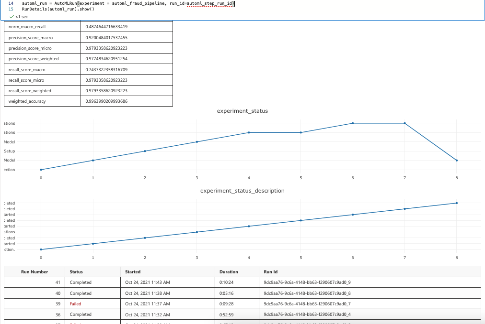

### Automated ML :: Results
The model performance is **`StackEnsemble`** with **AUC = 0.93668**

 Wiht following the set of hyperparameters and set of model to be ensembled.
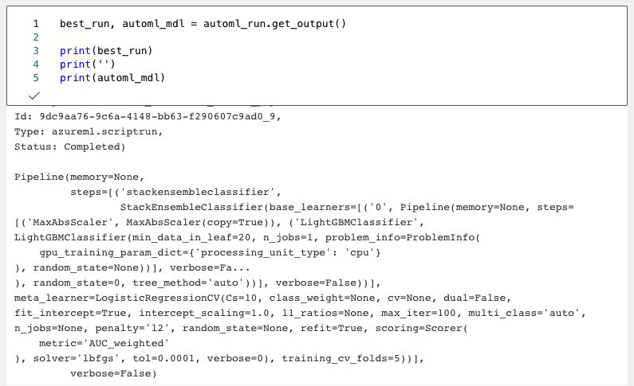

The way to improve AutoML run base on this experiment, we might consider as below items.
- Use `featurization` configuration on Azure AutoML.
- Increase number of `iterations` to higher number (~ 100 - 200) and enable the `enable_early_stopping`

### Automated ML :: Register Model
We will use Azure SDK to register the model to model store as below script. <br>
**`automl_run`** is AutoMLRun class that completed run from experiment.

After completed register via Azure SDK, we can go to check the model list in Azure ML Studio as below picture.
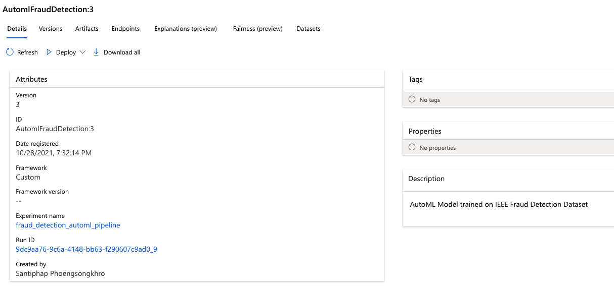

## 4.) Light Gradient Boosting with Hyperdrive.
 Light Gradigent Boosting Classifier (LGBM) is choosen to be benchmarking model with Azure AutoML.<br>
 This model is ensemble algorithms. They use a special type of decision trees (called weak learners) to capture complex and non-linear pattern in data. 

LGBM will grow their tree by leaf-wise approach, The structure continues to grow with the most promising branches and leaves (nodes with the most delta loss), holding the number of the decision leaves constant. 
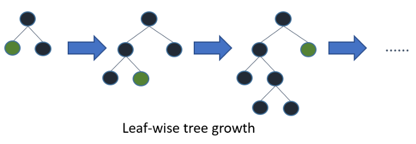


To submit hyperdriver experiment, hyperdrive specific environment need to be createcd. Additional python package here is [lightbm](https://lightgbm.readthedocs.io/en/latest/index.html). Below script will creater `hyperdrive_env.yml` file for environment creation later.

```python
%%writefile hyperdrive_env.yml
name: batch_environment
dependencies:
- python=3.6.9
- scikit-learn
- pandas
- numpy
- lightgbm
- pip
- pip:
  - azureml-defaults
```
Then initiate environment object from .yml file for using when submit experiment.
```python
# Create a Python environment for the experiment
hyper_env = Environment.from_conda_specification("experiment_env", "./hyperdrive_env.yml")
```

For **Hyperdrive Configurations** I have set as below script.
- **Early Stopping Policy** <br>
EarlyStopping policy is slected to be BanditPolicy
This policy can stop an iteration if the selected performance metric under performs comparing with the best run by specified margin which is `slack_factor`. With this character, it can save time when we perform large hyperparameter search space.

- **Parameter Search Method** <br>
Benefit of `RandomParameterSampling` on HyperDrive is it support both discrete (choice) and continuous (many statistic functions) set of hyperparameters.
This make the `RandomParameterSampling` have flexible in setting, moderate to low time consume of hyper parameter tuning and good for discovery the group of hypermeters. (Mostly requires additional number of time to run to detail search again)

- **Metrics** <br>
primary_metric_name = 'AUC',
primary_metric_goal=PrimaryMetricGoal.MAXIMIZE
These 2 setting need to match base on thier value. For `AUC` our goal is to maximize.
- **Running** <br>
max_total_runs = 100 : This value will limit the max iterations for each combination of hyperparameter set. <br>
max_concurrent_runs = 4 : This is maximum parallel run at a time.

- **Hyperparameters of LGBM** <br>
Mix setup between `choice` (discreate value set) and `uniform` (continuos value set) in search space of hyperparameter. Meaning and impact for each of them are as below list.

<ins>Group 1 :: Overfitting Control</ins> <br>
>`num_leaves` : It controls number of decision leaves within single tree. The decision leaf of a tree is the node where the "actual decision" happens.<br>
>`min_data_in_leaf` : Specify the minimum number data that fit on leaf node (decicison criteria) <br>
>`max_depth` : It controls the max depth level of tree. The higher will make tree to be more complex and prone to overfit. <br>
>`feature_fraction` : Control the percentage (0, 1) of feature to sample when training each tree.<br>
>`min_child_weight` : Control minimum number of samples that a node can represent in order to be split futher.<br>
>`bagging_fraction` : Control the percentage (0, 1) of training samples to be used in each tree.<br>

<ins>Group 2 :: Accuracy Control</ins> <br>
>`learning_rate` : Control learning speed, if value is higher the faster converge solution will be found.<br>

```python
# Create an early termination policy. This is not required if you are using Bayesian sampling.
early_termination_policy = BanditPolicy(evaluation_interval = 2, slack_factor = 0.1)

# Create the different params that you will be using during training
param_sampling = RandomParameterSampling(
    {
        '--num_leaves' : choice(350, 370, 400, 420, 450, 470, 490, 510, 530),
        '--min_child_weight' : uniform(0.02, 0.2),
        '--feature_fraction' : uniform(0.2, 0.5),
        '--bagging_fraction' : uniform(0.2, 0.5),
        '--min_data_in_leaf' : choice(range(80, 151)),
        '--max_depth' : choice(-1, 1, 2, 3, 4, 5, 6, 7, 8 , 9, 10, 15, 20 ,25, 30 ,35, 40 ,45),
        '--learning_rate' : uniform(0.001, 0.02)
    }
)

# ScriptRun object for customer script
estimator = ScriptRunConfig(source_directory = training_folder,
                            script = 'train_model.py',
                            arguments = ['--input-data', train_dataset_hd],
                            environment = hyper_env,
                            compute_target = cpu_cluster)

# Hyperdrive configuration
hyperdrive_run_config = HyperDriveConfig(run_config = estimator,
                                        hyperparameter_sampling = param_sampling,
                                        policy = early_termination_policy,
                                        primary_metric_name = 'AUC',
                                        primary_metric_goal=PrimaryMetricGoal.MAXIMIZE,
                                        max_total_runs = 100,
                                        max_concurrent_runs = 4)
```

Create `metrics_output` and `model_output` path as a pipeline output for `HyperDriveStep`
```python
hyperdrive_metrics_output_name = 'metrics_output'
hyperdrive_best_iter_outputname = 'best_iter_output'

metrics_data = PipelineData(name = "metrics_data",
                        datastore = def_blob_store,
                        pipeline_output_name = hyperdrive_metrics_output_name,
                        training_output = TrainingOutput(type = "Metrics"))

model_data = PipelineData(name = "model_data",
                          datastore = def_blob_store,
                          pipeline_output_name = hyperdrive_best_iter_outputname,
                          training_output = TrainingOutput(type= "Model",
                                                         model_file="outputs/model/hyperdrive_lgbm_fraud.pkl"))


hd_step_name = 'hd_step'
hd_step = HyperDriveStep(
            name = hd_step_name,
            hyperdrive_config = hyperdrive_run_config,
            inputs = [train_dataset_hd],
            outputs = [metrics_data, model_data]
```
When summit the experiment, pipeline running status can be tracked. (Below is example from Azure ML Studio.)
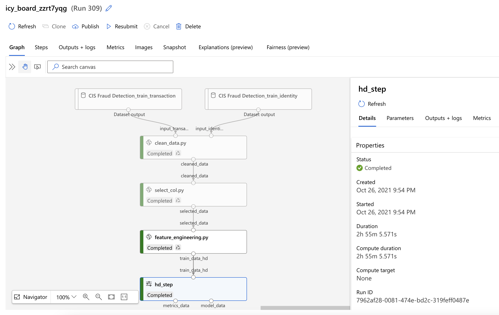

### LGBM with Hyperdrive :: Results
Best set of hyperparamer can be retrieve both via Azure SDK and Azure ML Studio. <br>
**Azure ML Studio**
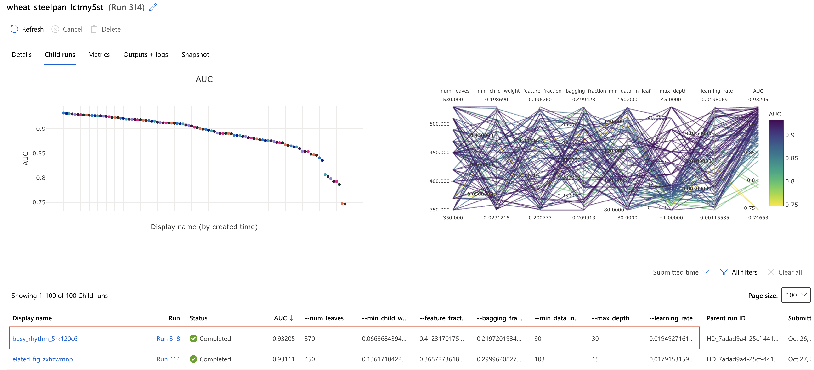
**Azure SDK**
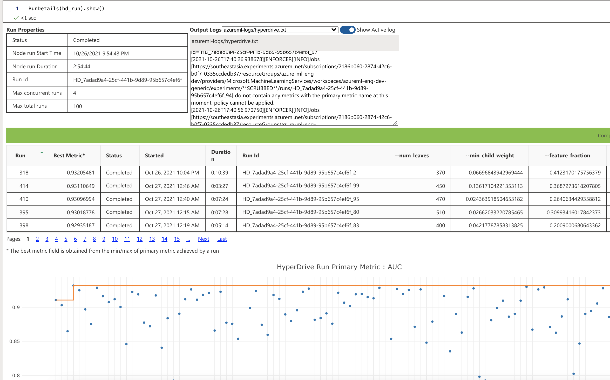
Highest `AUC` is **0.93205** and at the best run hyperparameter is as below record.
```python
'bagging_fraction' :0.2197201934013026 
'feature_fraction' : 0.4123170175756379 
'learning_rate', 0.019492716106797613
'max_depth' : 30
'min_child_weight' : 0.06696843942969444
'min_data_in_leaf' : 90
 'num_leaves' :370
```
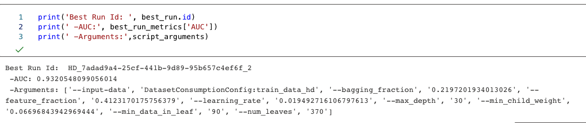

To improve the results in term of modelling, we might consider these items.
- Increase number of `max_total_runs` from 100 to higher number (~500 - 1000)
- Details search in area of good performance hyperparameters by using `GridParameterSampling`


### LGBM Hyperdrive :: Register Model
We will use Azure SDK to register the best model. <br>
**`best_run`** get from HyperDriveRun we have submitted as below script.
```python
best_run = hd_run.get_best_run_by_primary_metric()
```


## 5.) Model Benchmarking and Model Deployment.
**Performance Comparing**
- `AUC` AutoML = **0.93668**
- `AUC` LGBM + Hyperdrive =  **0.93205** 

**Training Time** (with iterations number) 
- 10 Iterations with **1h 16m 50s**
- 100 Iterations with **2h 55m 56s**

Best on above 2 dimensions, AutoML seem to out perform interm of performance and training time. Also ease of complex configuration. AutoML can start to use with new data without customer_script.

And moreover model explanability can be use to investigate the impact of each features on model performance. So final model to deploy will be **Automated ML from Azure**
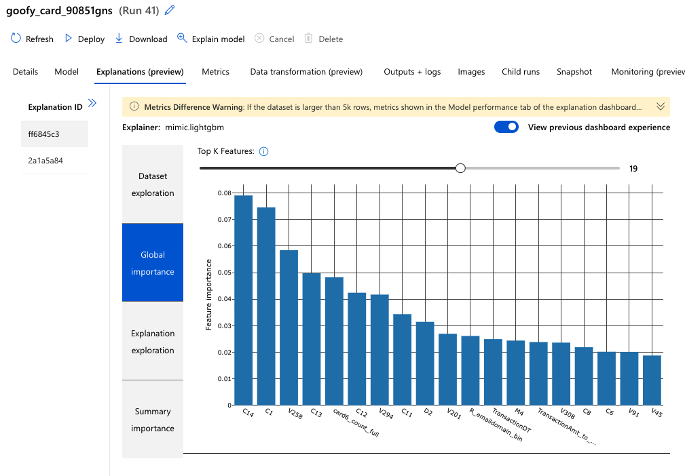
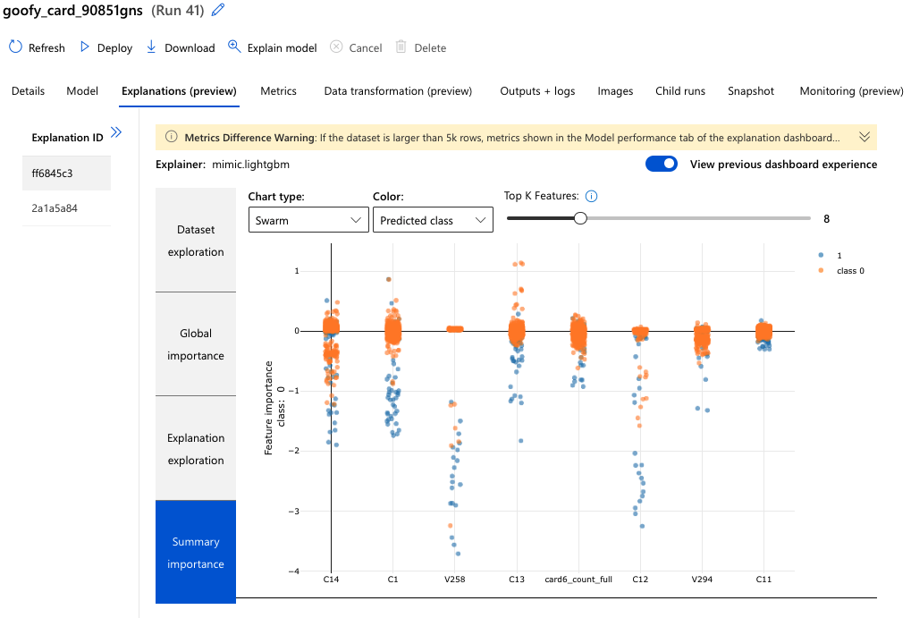


## 6.) Model Deployment and Endpoint Testing
To deploy trained AutoML, both method from Azure ML Studio and Azure SDK can be selected.
Below is example of using Azure SDK.

What you need is type of deployement, scoring script, and ACIWebService Spec.
```python
script_file_name = "inference/score.py"
best_run.download_file("outputs/scoring_file_v_1_0_0.py", "inference/score.py")

inference_config = InferenceConfig(entry_script=script_file_name)

aciconfig = AciWebservice.deploy_configuration(
    cpu_cores=2,
    memory_gb=2,
    tags={"area": "IEEE_CIS_FraudData", "type": "automl_classification"},
    description="Deployed Automl for Fraud Detection",
    auth_enabled=True
)
```
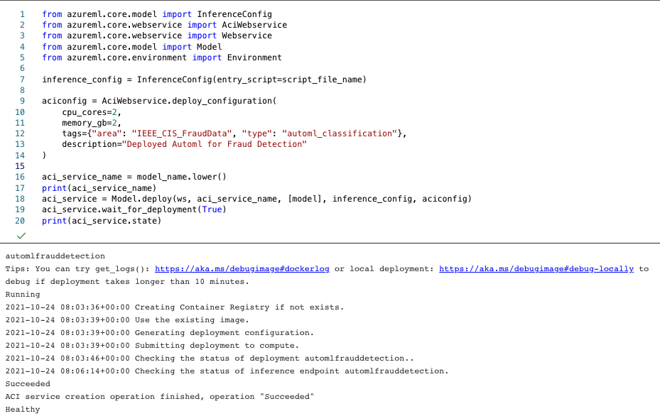

After completed deploy progress, we can go to check endpoint on Azure ML Studio as below. 
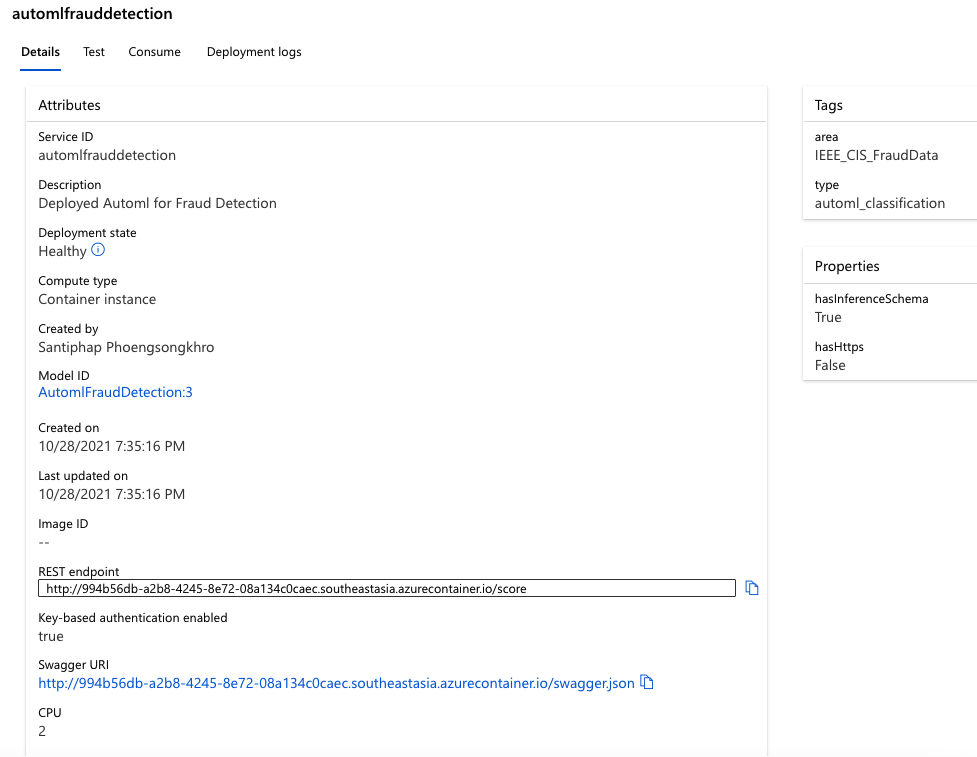
And endpoint URL is as below.

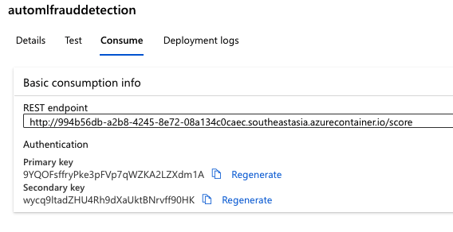

To test the endpoints, we will make HTTP post request by using below script.

What this code do is use endpoint URI and authentication key to point to our deployed model.

Then we need to have all data in same format as we trained our model and convert it to json format to make the request.

```python
import requests
import json

# URL for the web service, should be similar to:
# 'http://8530a665-66f3-49c8-a953-b82a2d312917.eastus.azurecontainer.io/score'
scoring_uri = 'http://994b56db-a2b8-4245-8e72-08a134c0caec.southeastasia.azurecontainer.io/score'

# If the service is authenticated, set the key or token
key = '9YQOFsffryPke3pFVp7qWZKA2LZXdm1A'

data = {"Example of single record is in endpoint_testing.py"}

# Convert to JSON string
input_data = json.dumps(data)
with open("data.json", "w") as _f:
    _f.write(input_data)

# Set the content type
headers = {'Content-Type': 'application/json'}
# If authentication is enabled, set the authorization header
headers['Authorization'] = f'Bearer {key}'

# Make the request and display the response
resp = requests.post(scoring_uri, input_data, headers=headers)
print(resp.json())

```

The result of make request can be found as below picture.
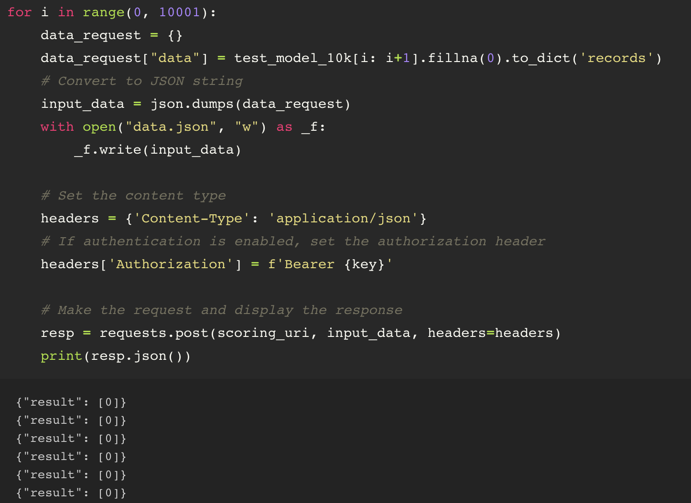

I also upload the testing script in the folder `endpoint_testing` by read in th test file from source data then you play around within

## **Application Insight on Endpoints
To track and monitor request status of deployed endpoint, use Azure Application Insight to collect the follow data from an endpoints:
- Output Data
- Responses
- Request rates, response times, and failure rates
- Dependency rates, response times, and failure rates
- Exceptions

Script to enable this function is in `log.py` which contains as below script.
What you need Azure Workspace config file and name of deployed endpoints.<br>

```python
from azureml.core import Workspace
from azureml.core.webservice import Webservice

# Requires the config to be downloaded first to the current working directory
ws = Workspace.from_config()

# Set with the deployment name
name = "automlfrauddetection"

# load existing web service
service = Webservice(name=name, workspace=ws)
service.update(enable_app_insights = True)

logs = service.get_logs()

for line in logs.split('\n'):
    print(line)
```

After complie this code, you can go back to check the application insight enable in the deployed model.
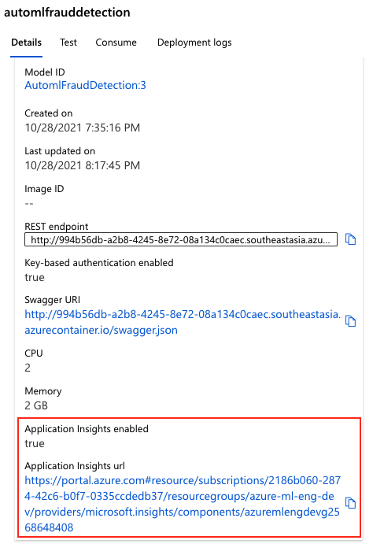

When click on application insight menu, monitoring dashboard is shown as below. THis dashboard can monitor all of items mentioned in above list.
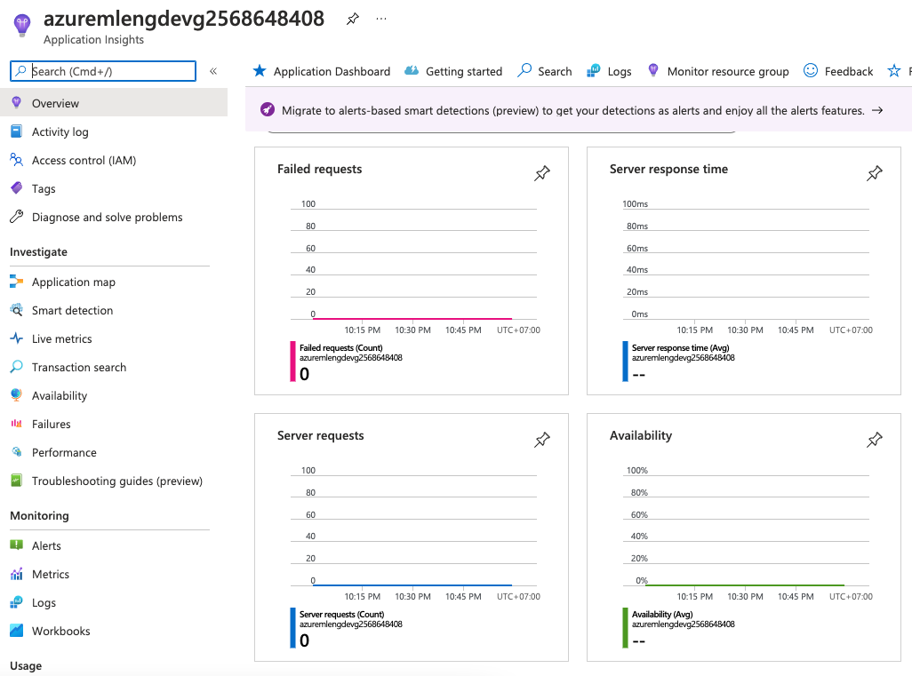


## **Swagger UI
Swagger helps to build, document and consume RESTful web service.
Azure provides a swagger.json that is used to create a web site that documents the HTTP endpoint for a deployed model.

You can download the `swagger.json` from deployed model on Azure ML Studio on Swagger URI.
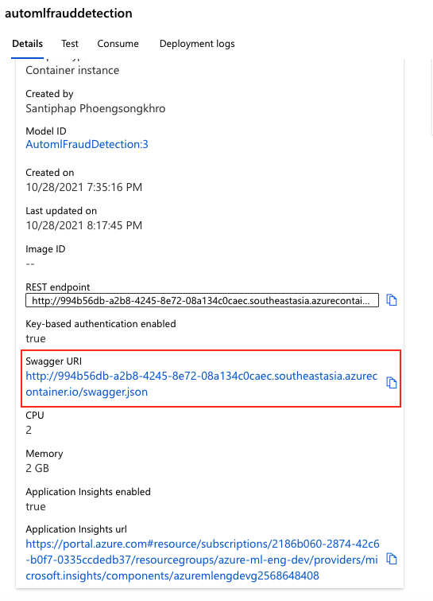

Place this file in the same directory as `swagger.sh` and `serve.py`. Run it consequently to deploy Swagger UI on local port. Result will be as below. (`swagger.sh` require docker to be run on your machine)
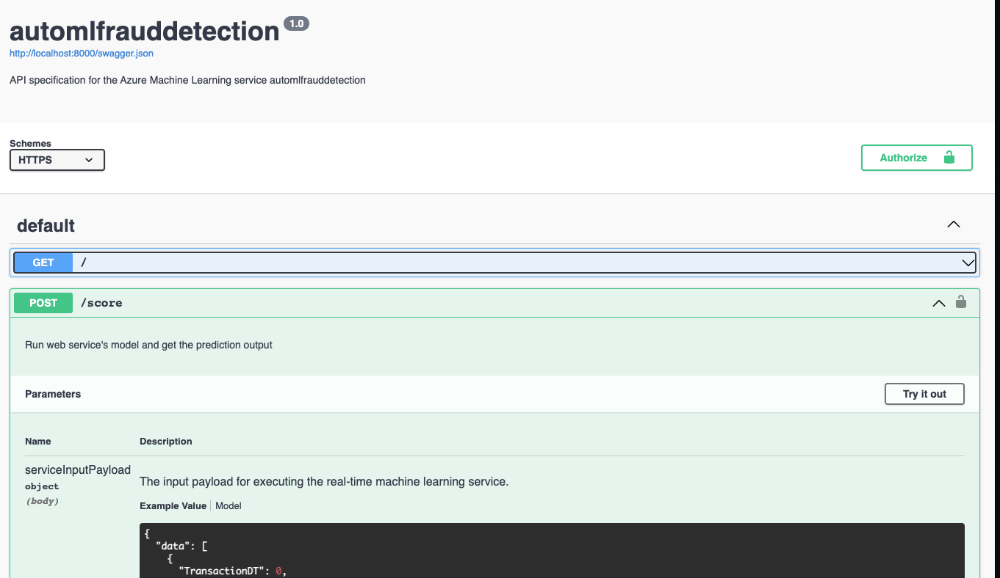

# Screen Cast


# Further work for improvement


# Ciatations and Reference
[Azure CLI](https://docs.microsoft.com/en-us/cli/azure/install-azure-cli-macos
)

[Request on AutoML Endpoint](https://github.com/MicrosoftLearning/mslearn-dp100/blob/main/02%20-%20Get%20AutoML%20Prediction.ipynb)

[Create Real Time Endpoints](https://github.com/MicrosoftLearning/mslearn-dp100/blob/main/09%20-%20Create%20a%20Real-time%20Inferencing%20Service.ipynb)

[Everythings about Pipeline](https://github.com/Azure/MachineLearningNotebooks/tree/master/how-to-use-azureml/machine-learning-pipelines) 

[Hyperdrive Tuning](https://github.com/MicrosoftLearning/mslearn-dp100/blob/main/11%20-%20Tune%20Hyperparameters.ipynb)