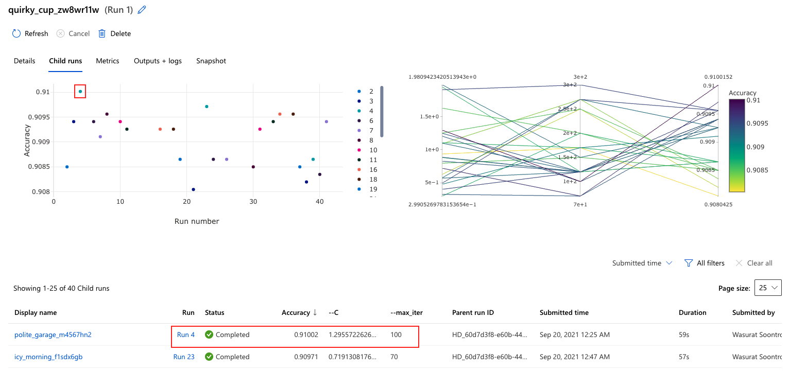
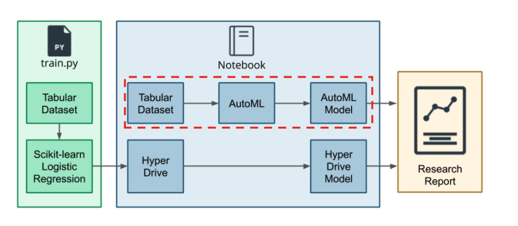
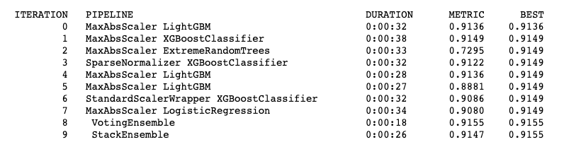
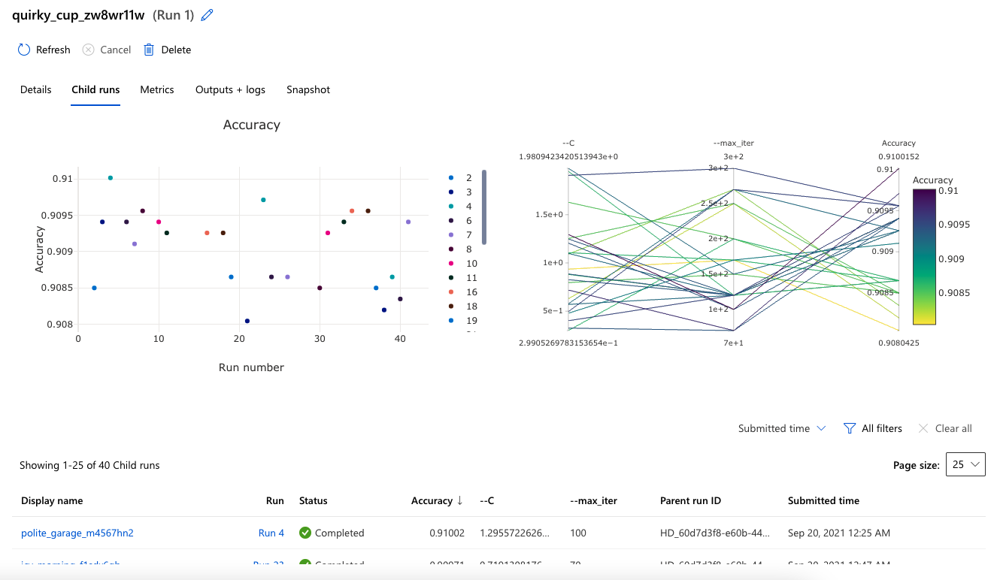
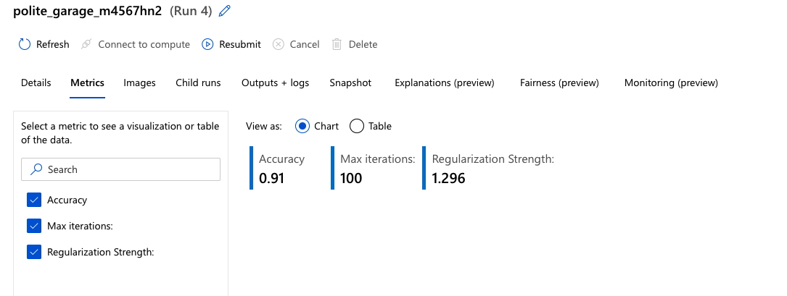
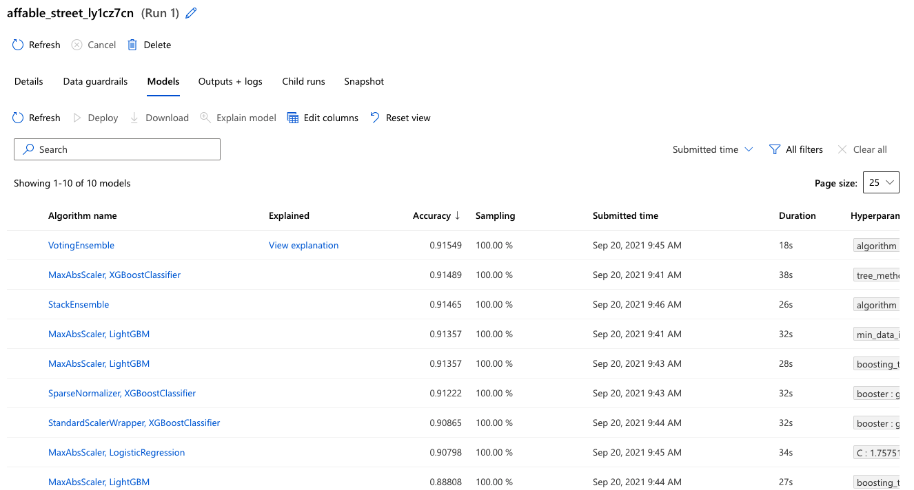
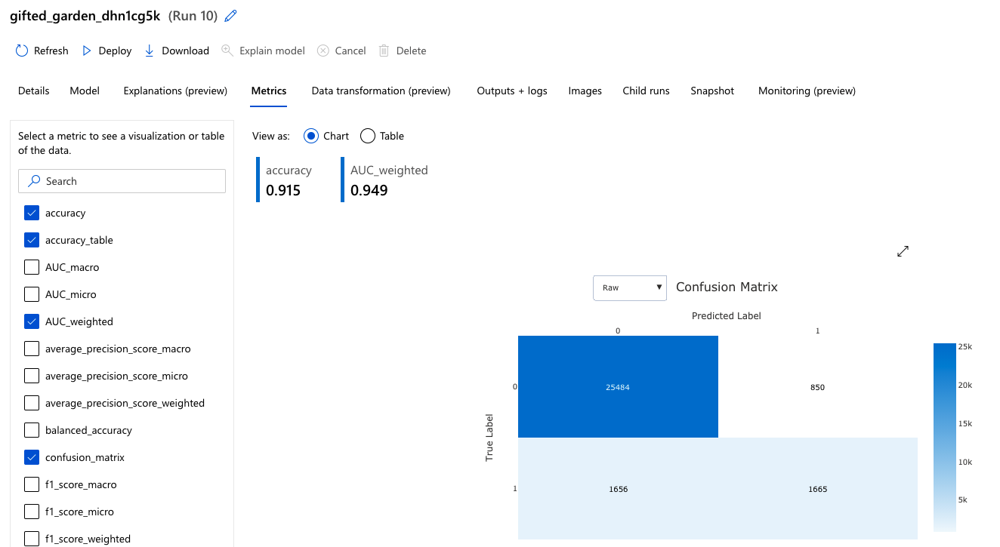
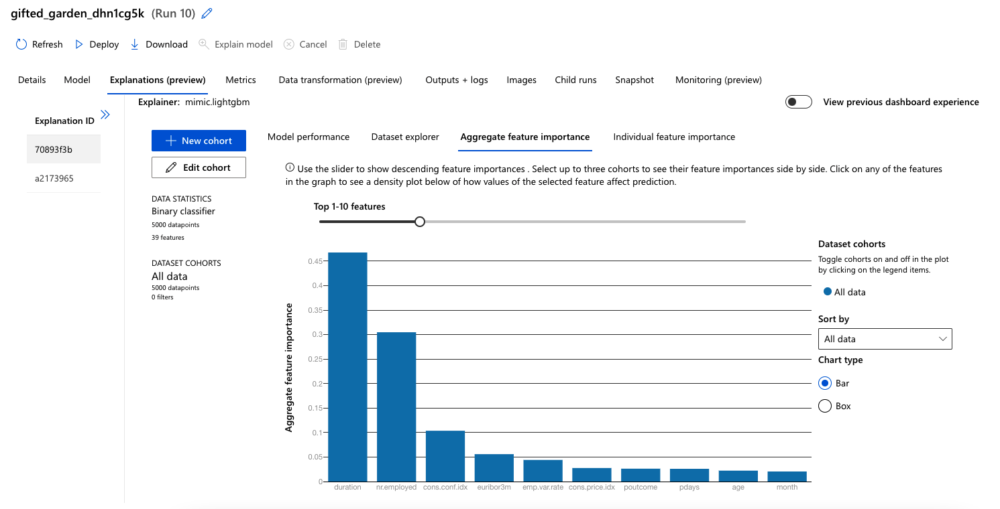
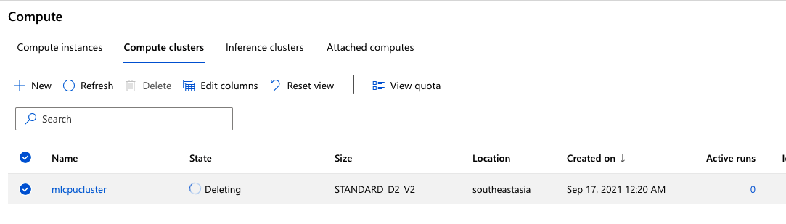

# Optimizing an Azure ML Pipeline

## Overview
This project is part of the Udacity Azure ML Nanodegree. In this project, we build and optimize an Azure ML pipeline using the Python SDK and a provided Scikit-learn model. This model is then compared to an Azure AutoML run.

## Summary
This data set is Bank Marketing from [UCI-ML Repository](https://archive.ics.uci.edu/ml/datasets/Bank+Marketing). <br>
The data is related with direct marketing campaigns of a Portuguese banking institution. This marketing campaigns is conducted by phone calls. Purpose is to direct contact to customer if the product (bank term deposit) would be `('yes')` or  `('no')` in subscription. <br>
So, we want to use these historical data features to predict whether bank term doposit would be `('yes')` or `('no')` in subscription.

The best performing model is a `VotingEnssemble` from AutoML Pipeline with accuracy = **0.91549** comparing with **0.91002** in accuracy from `Scikit Learn-Logisitc Regression with HyperDrive`

## ML Pipeline
### Scikit-learn Pipeline with HyperDrive

#### Pipeline Architecture
On Scikit-lean pipeline, it will compose with python script (`train.py`) to handle all the data preprocessing and training Logistic Regression Model from Scikit-Learn.  

Then Jupyter Notebook (`udacity-project.ipynb`) will be used to orchestrate all the process with Azure ML environment via Azure SDK. 

> * Starting from connect to the **Workspace** 
>  ```python
> ws = Workspace.get(name="udacity-project", 
>                   subscription_id= '590fde7b-1b27-4bfd-a40b-08d9385aa863',
>                   resource_group= 'ml-eng-azure')
> exp = Experiment(workspace=ws, name="udacity-project")
> ```
> * Create **ComputeTarget** 
> ```python
>cpu_cluster_name = 'mlcpucluster'
>compute_config = AmlCompute.provisioning_configuration(vm_size = 'STANDARD_D2_V2',
>                                                            max_nodes = 4)
>cpu_cluster = ComputeTarget.create(ws, cpu_cluster_name, compute_config)
>```
> * Config **Environment** for python script 
> ```python
>%%writefile hyperdrive_env.yml
>name: sklearn_hyperdrive_env
>dependencies:
>- python=3.6.2
>- scikit-learn
>- pandas
>- numpy
>- pip
>- pip:
>  - azureml-defaults
>```
> * Establish and config **Hyperparameter Tuning** with **HyperDrive**
> 
> `RandomParameterSampling` is selected with 2 hyperparamter for searching (`C` and `max_iter`) <br>
>Benefit of `RandomParameterSampling` on HyperDrive is it support both discrete (`choice`) and continuous (many statictic functions) set of hyperparameters. Together with `EarlyStopping` policy that can select by user. <br>
>
> This make the `RandomParameterSampling` have flexible in setting, moderate to low time consume of hyper parameter tuning and good for discovery the group of hypermeters. (Mostly requires additional number of time to run) <br>
> 
> `EarlyStopping` policy is slected to be `BanditPolicy` <br>
> This policy can stop an iteration if the selected performance metric under performs comparing with the best run by specified margin which is `slack_factor`. With this character, it can save time when we perform large hyperparameter search space.
> 
> ```python
> # Paramter for tuning
>ps = RandomParameterSampling(
>    {
>        '--C' : uniform(0.1, 2.0),
>        '--max_iter' : choice(20, 50, 70, 100, 120, 150, 170, 200, 220, 250 , 270 ,300)
>    }
>)
>
># Early Stopping Policy
>policy = BanditPolicy(slack_factor = 0.1, evaluation_interval = 1, delay_evaluation = 5)
>
>```
> * Connect training script with `ScriptRunConfig` and establish `HyperDrive`
> ```python
> # Swith to use ScriptRunConfig instead of SKLearn due to deprecate
>est = ScriptRunConfig(source_directory = os.getcwd(),
>                     script = 'train.py',
>                     compute_target = cpu_cluster,
>                     environment = hyper_env)
>
># Create a HyperDriveConfig using the estimator, hyperparameter sampler, and policy.
>hyperdrive_config = HyperDriveConfig(run_config = est,
>                                    hyperparameter_sampling = ps,
>                                    policy = policy,
>                                    primary_metric_name = 'Accuracy',
>                                    primary_metric_goal = PrimaryMetricGoal.MAXIMIZE,
>                                    max_total_runs = 40,
>                                    max_concurrent_runs = 4)
>```

> * Submit **Experiment** to Azure ML 
> ```python
> experiment = Experiment(workspace = ws, name = 'bank-market-binary-hyperdrive_final')
>run = experiment.submit(config = hyperdrive_config)
>```
> * Register best model.
> ```python
> best_run = run.get_best_run_by_primary_metric()
>best_run_metrics = best_run.get_metrics()
>script_arguments = best_run.get_details()['runDefinition']['arguments']
>best_run.register_model(model_path='outputs/LogisBinaryModel.pkl', model_name='bankmarketing_model',
>                        tags={'Training context':'Hyperdrive'},
>                        properties={'Accuracy': best_run_metrics['Accuracy']})

### Scikit-learn with HyperDrive Result

Best performance is `C` = 1.2955722626880386 and `max_iter` = 100 with accuracy = 0.91002


### AutoML

#### Pipeline Architecture
After complete clean data (import function from `train.py`) and split data for training with same pipeline of Scikit-Learn with Hyperdrive, AutoML set up with below configurations.
>```python
>automl_config = AutoMLConfig(
>    experiment_timeout_minutes=30,
>    task= 'classification',
>    primary_metric= 'accuracy',
>    training_data= train_ds,
>    label_column_name= 'y',
>    iterations = 10,
>    max_concurrent_iterations = 4,
>    n_cross_validations = 4,
>    featurization = 'auto')
>```
* Submit **Experiment** to Azure ML 
>```python
>automl_experiment = Experiment(ws, 'bank-market-automl-sdk')
>automl_run = automl_experiment.submit(automl_config)
>```
* Result of each iterations can be found as below.


* Get the complete pipeline on the best run
> ```python
>best_run, fitted_model = automl_run.get_output()
>best_run_metrics = best_run.get_metrics()
>```
### AutoML Result
The best run from AutoML is `VotingEnsemble` from combination of 5 paring pipeline-algorithm. Accuracy is **0.91549**
>```python
>algorithm = {1 : 'StandardScalerWrapper : XGBoostClassifier', 
>             2 : 'MaxAbsScaler : LightGBM', 
>             3 : 'MaxAbsScaler : LightGBM', 
>             4 : 'MaxAbsScaler : XGBoostClassifier',
>             5 : 'SpareNormalizer : XGBoostClassifier'}
>```
And coefficient on each algoritm on voting is following order.
>```python
> { 1 : 0.125, 2 : 0.125, 3 : 0.25, 4 : 0.25, 5 : 0.25 } 
>```
Example of hyperparameter setting from AutoML Voting Ensemble
>```python
>{
>    "class_name": "LightGBMClassifier",
>    "module": "automl.client.core.common.model_wrappers",
>    "param_args": [],
>    "param_kwargs": {
>        "boosting_type": "gbdt",
>        "colsample_bytree": 0.6933333333333332,
>        "learning_rate": 0.09473736842105263,
>        "max_bin": 110,
>        "max_depth": 8,
>        "min_child_weight": 6,
>        "min_data_in_leaf": 0.003457931034482759,
>        "min_split_gain": 1,
>        "n_estimators": 25,
>        "num_leaves": 227,
>        "reg_alpha": 0.9473684210526315,
>        "reg_lambda": 0.42105263157894735,
>        "subsample": 0.49526315789473685
>    },
>    "prepared_kwargs": {},
>    "spec_class": "sklearn"
>}
>``` 
## Pipeline comparison
### Scikit-Learn with HyperDrive
### * Overall Result

### * Pipeline Performance


With this pipeline, to create the machine learning it require to use custom script (`train.py`) with defined environment to interface with Azure SDK <br>
This give a lot more flexible but add more on time consume and complexity. Final accuracy is **0.91002** <br>

On metrics summary page in AzureML Studio, only pre-define metrics in script have been collected and logged with no model explainability.

### AutoML
### * Overall Result

### * Pipeline Performance

### * Model Explainer

In AutoML pipeline, setup is shorthen by creating AutoML configuration and submit the experiment to AzureML.
Final accuracy is **0.91549**. with built-in model explainability and customizable metrics.

The accuracy might not much difference with the Scikit-Learn HyperDrive Pipeline but less complexity in setup is benefit with AutoML.
We can spend more time on cleaning data and find the insight from model with model explainability module in AzureML Studio.


## Future Work
1.) Deep drive into data preprocessing by using model explainability module from AutoML(cleaning, feature engineering and feature selection)

2.) For Scikit-Learn pipeline, use more complex model and number of hyperparameter to be tunned together with difference searching method `BayesianParameterSampling`. Early stopping policy also can be try with difference strategy.

3.) Test both model pipeline on unseen data.

## Clear Cluster after use

Delete cluster via UI on Azure Machine Learning Studio

## Reference

### Initial code
[Udacity](https://github.com/udacity/nd00333_AZMLND_Optimizing_a_Pipeline_in_Azure-Starter_Files)

### AzureML SDK
[Tune Hyperparameters](https://github.com/MicrosoftLearning/mslearn-dp100/blob/main/11%20-%20Tune%20Hyperparameters.ipynb) <br>
[Use Automated Machine Learning](https://github.com/MicrosoftLearning/mslearn-dp100/blob/main/12%20-%20Use%20Automated%20Machine%20Learning.ipynb)
