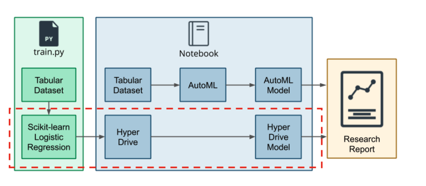

# Optimizing an Azure ML Pipeline

## Overview
This project is part of the Udacity Azure ML Nanodegree. In this project, we build and optimize an Azure ML pipeline using the Python SDK and a provided Scikit-learn model. This model is then compared to an Azure AutoML run.

## Summary
This data set is Bank Marketing from [UCI-ML Repository](https://archive.ics.uci.edu/ml/datasets/Bank+Marketing). <br>
The data is related with direct marketing campaigns of a Portuguese banking institution. This marketing campaigns is conducted by phone calls. Purpose is to direct contact to customer if the product (bank term deposit) would be `('yes')` or  `('no')` in subscription. <br>
So, we want to use these historical data features to predict whether bank term doposit would be `('yes')` or `('no')` in subscription.

The best performing model is a `VotingEnssemble` from AutoML Pipeline with accuracy = **0.91549** comparing with **0.91002** in accuracy from `Scikit Learn-Logisitc Regression with HyperDrive`

## ML Pipeline
### Scikit-learn Pipeline with HyperDrive

#### Pipeline Architecture
On Scikit-lean pipeline, it will compose with python script (`train.py`) to handle all the data preprocessing and training Logistic Regression Model from Scikit-Learn.  

Then Jupyter Notebook (`udacity-project.ipynb`) will be used to orchestrate all the process with Azure ML environment via Azure SDK. 

> * Starting from connect to the **Workspace** 
>  ```python
> ws = Workspace.get(name="udacity-project", 
>                   subscription_id= '590fde7b-1b27-4bfd-a40b-08d9385aa863',
>                   resource_group= 'ml-eng-azure')
> exp = Experiment(workspace=ws, name="udacity-project")
> ```
> * Create **ComputeTarget** 
> ```python
>cpu_cluster_name = 'mlcpucluster'
>compute_config = AmlCompute.provisioning_configuration(vm_size = 'STANDARD_D2_V2',
>                                                            max_nodes = 4)
>cpu_cluster = ComputeTarget.create(ws, cpu_cluster_name, compute_config)
>```
> * Config **Environment** for python script 
> ```python
>%%writefile hyperdrive_env.yml
>name: sklearn_hyperdrive_env
>dependencies:
>- python=3.6.2
>- scikit-learn
>- pandas
>- numpy
>- pip
>- pip:
>  - azureml-defaults
>```
> * Establish and config **Hyperparameter Tuning** with **HyperDrive**
> 
> `RandomParameterSampling` is selected with 2 hyperparamter for searching (`C` and `max_iter`)
> ```python
> # Paramter for tuning
>ps = RandomParameterSampling(
>    {
>        '--C' : uniform(0.1, 2.0),
>        '--max_iter' : choice(20, 50, 70, 100, 120, 150, 170, 200, 220, 250 , 270 ,300)
>    }
>)
>
># Early Stopping Policy
>policy = BanditPolicy(slack_factor = 0.1, evaluation_interval = 1, delay_evaluation = 5)
>
>```
> * Connect training script with `ScriptRunConfig` and establish `HyperDrive`
> ```python
> # Swith to use ScriptRunConfig instead of SKLearn due to deprecate
>est = ScriptRunConfig(source_directory = os.getcwd(),
>                     script = 'train.py',
>                     compute_target = cpu_cluster,
>                     environment = hyper_env)
>
># Create a HyperDriveConfig using the estimator, hyperparameter sampler, and policy.
>hyperdrive_config = HyperDriveConfig(run_config = est,
>                                    hyperparameter_sampling = ps,
>                                    policy = policy,
>                                    primary_metric_name = 'Accuracy',
>                                    primary_metric_goal = PrimaryMetricGoal.MAXIMIZE,
>                                    max_total_runs = 40,
>                                    max_concurrent_runs = 4)
>```

> * Submit **Experiment** to Azure ML 
> ```python
> experiment = Experiment(workspace = ws, name = 'bank-market-binary-hyperdrive_final')
>run = experiment.submit(config = hyperdrive_config)
>```
> * Register best model.
> ```python
> best_run = run.get_best_run_by_primary_metric()
>best_run_metrics = best_run.get_metrics()
>script_arguments = best_run.get_details()['runDefinition']['arguments']
>best_run.register_model(model_path='outputs/LogisBinaryModel.pkl', model_name='bankmarketing_model',
>                        tags={'Training context':'Hyperdrive'},
>                        properties={'Accuracy': best_run_metrics['Accuracy']})


### AutoML

### Pipeline comparison

## Future Work

## Reference

### Initial code
[Udacity](https://github.com/udacity/nd00333_AZMLND_Optimizing_a_Pipeline_in_Azure-Starter_Files)

### AzureML SDK
[Tune Hyperparameters](https://github.com/MicrosoftLearning/mslearn-dp100/blob/main/11%20-%20Tune%20Hyperparameters.ipynb) <br>
[Use Automated Machine Learning](https://github.com/MicrosoftLearning/mslearn-dp100/blob/main/12%20-%20Use%20Automated%20Machine%20Learning.ipynb)
